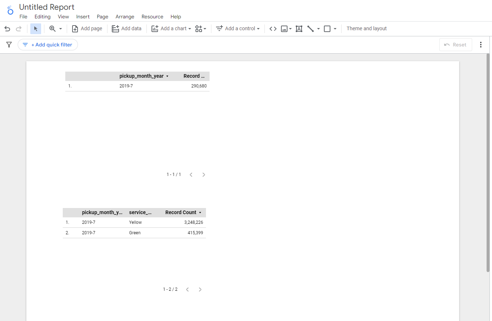

## Big Query

## Setup 

```SQL
CREATE OR REPLACE EXTERNAL TABLE `terraformproject-123489.trips_data_all.external_fhv_taxi_2019`
OPTIONS (
  format = 'PARQUET',
  uris = ['gs://zoomcamp_week3_bigquery_andy_burns/fhv/*']
)
;


CREATE OR REPLACE TABLE `terraformproject-123489.trips_data_all.fhv_tripdata` AS
SELECT * FROM `terraformproject-123489.trips_data_all.external_fhv_taxi_2019`;
;
```

## Question 1: What happens when we execute dbt build --vars '{'is_test_run':'true'}' You'll need to have completed the "Build the first dbt models" video.
- `It applies a limit 100 only to our staging models`


## Question 2. What is the code that our CI job will run? Where is this code coming from?
- `The code from the development branch we are requesting to merge to main`


## Question 3 (2 points) What is the count of records in the model fact_fhv_trips after running all dependencies with the test run variable disabled (:false)?
- `22998722`


## Question 4 What is the service that had the most rides during the month of July 2019 month with the biggest amount of rides after building a tile for the fact_fhv_trips table?
- `Yellow`

