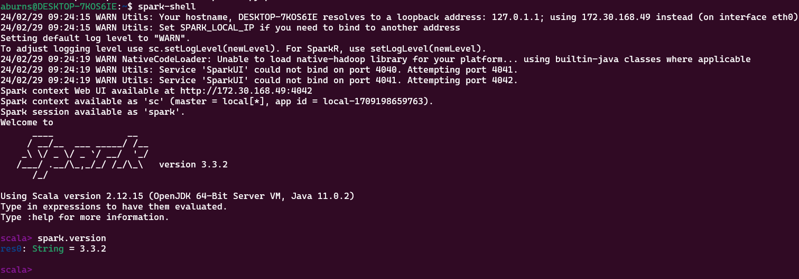
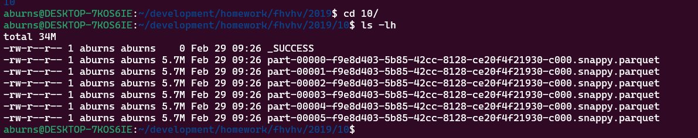

## Spark

## Question 1: Execute spark.version. What's the output?
- `res0: String = 3.3.2`



## Question 2. What is the average size of the Parquet (ending with .parquet extension) Files that were created (in MB)? Select the answer which most closely matches.
- `6MB`



## Question 3 How many taxi trips were there on the 15th of October? Consider only trips that started on the 15th of October.
- `62610`
```sql
from pyspark.sql import functions as F
df = df.withColumn('pickup_date', F.to_date(df.pickup_datetime)) \
    .withColumn('dropoff_date', F.to_date(df.dropOff_datetime))

q3 = df.filter(df.pickup_date == '2019-10-15').count()
q3
```


## Question 4 Longest trip for each day. What is the length of the longest trip in the dataset in hours?
- `631,152.50 Hours`
```sql
df = df.withColumn('trip_time', F.round((F.col("dropOff_datetime").cast("long") - F.col("pickup_datetime").cast("long"))/3600,2))
q4 = df.select(F.max(df.trip_time)).show()
q4
```


## Question 5 Spark’s User Interface which shows the application's dashboard runs on which local port?
- `4040`


## Question 6 Least frequent pickup location zone. Load the zone lookup data into a temp view in Spark. Using the zone lookup data and the FHV October 2019 data, what is the name of the LEAST frequent pickup location Zone?
- `Jamaica Bay`

```python
location = spark.read.csv("taxi_zone_lookup.csv", header=True, inferSchema=True)
df.createOrReplaceTempView ('trips_data')
location.createOrReplaceTempView ('location')

q6 = spark.sql("""
    SELECT 
        Zone,
        count(*)
    FROM trips_data 
    JOIN location ON trips_data.PUlocationID = location.LocationID
    GROUP BY Zone
    ORDER BY count(*) ASC
""")
q6.show()

```